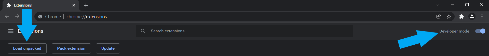
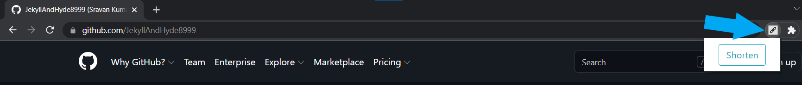
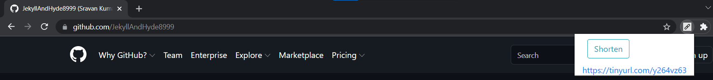

# URL Shortener Extension

This is a Chrome extension that can shorten the URL present in the currently selected tab using [TinyURL](https://tinyurl.com/app).

## Installation

_This extension has only been tested on Google Chrome._

1. Download and extract the `ShortenerExtension` folder.
2. Go to `chrome://extensions`.
3. Enable "Developer Mode" at the top right of the page.
4. At the top left, click "Load Unpacked". This should open a file selection dialog box.
5. Navigate to the location of the `ShortenerExtension` folder you extracted and select the folder.
6. The extension should be installed and should also be visible from the extensions menu in the toolbar.

## Usage
1. Go to any link you'd like to shorten.
2. Click on the extension. A popup should appear.
3. Click on the "Shorten" button.
4. The shortened URL should appear below the button.

